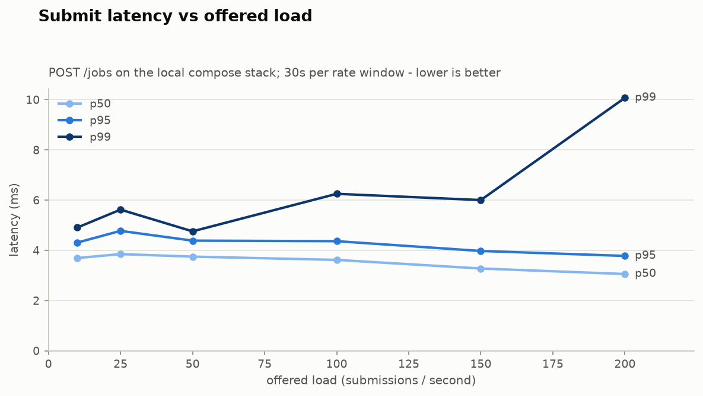
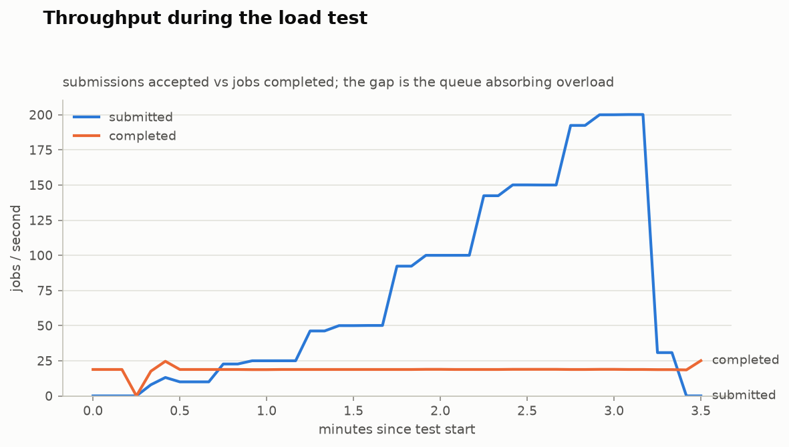

# ORBITER

**A distributed simulation orchestration platform that survives chaos — measured, not claimed.**

ORBITER accepts long-running compute jobs over HTTP, distributes them across an autoscaling
worker fleet, and keeps its promises while workers die, nodes get reclaimed, networks
partition, and clocks skew. It exists to demonstrate — with charts, traces, and chaos
experiments — *why* distributed systems need idempotency, backpressure, fencing tokens,
and graceful shutdown.

> I built continuous integration for ISS simulation models at NASA on a single machine.
> ORBITER is that problem rebuilt at fleet scale: a spot-instance worker fleet that scales
> on queue depth, survives losing nodes mid-run, and chaos-tests itself every night.

## Status

**Phases 0–2 complete:** walking skeleton + survival mechanics, proven end to end
against real NATS JetStream, Postgres, and Valkey in CI. **Phase 3 next:** EKS,
KEDA scale-to-zero, Karpenter spot fleet, load curves.

- [x] Event-sourced job state machine, property-tested (no illegal transition is representable)
- [x] Idempotent submission (`Idempotency-Key`, Stripe semantics) and idempotent execution
- [x] Transactional outbox — no dual-write window between Postgres and the broker
- [x] Fenced leases — stale lease holders are rejected at the write site (Kleppmann's
      Redlock critique, implemented and unit-tested under simulated clock skew)
- [x] Bounded admission control — 429 + `Retry-After`, rejection over buffering
- [x] Worker with graceful SIGTERM shutdown; retries with backoff; permanent-failure handling
- [x] End-to-end integration suite against real NATS JetStream, Postgres, and Valkey
- [x] Durable dead-letter path: poison jobs quarantined via captured max-deliveries
      advisories, inspectable at `GET /dlq`, replayable by operator action (ADR-0006)
- [x] KEDA scale-to-zero + Karpenter fleet on EKS — proven live: 21/21 jobs, 0→4→0
      workers, nodes bought and sold, 65s cold start measured; the free-plan account
      refused the spot market and the on-demand fallback pool absorbed it by design
- [x] OpenTelemetry end to end: ONE trace per job across api → relay → worker (context
      rides inside the message), RED metrics, Grafana + Tempo + Prometheus in compose
- [ ] SLO burn-rate alerts, exemplars, k6 load curves (Phase 4 continues)
- [x] The CHAOS button (`GET /chaos`): kills a random worker mid-job via a queue-group
      message (ADR-0007) — and its first live sessions found two real defects
      (synchronized-timeout starvation, missing lost-worker recovery transition),
      both DLQ-caught, fixed, and regression-tested. Recovery now: 30s, the AckWait floor
- [ ] Chaos Mesh on EKS: pod kill, broker partition, TimeChaos clock skew + recordings
      (Phase 5 cloud half, next apply day)
- [ ] Supply chain: SBOM, Trivy gate, cosign signing, Kyverno admission (Phase 6)

## Architecture

```
   client ──REST──▶ API (FastAPI) ── 1 tx ──▶ Postgres (jobs + events + outbox)
                     │ 429+Retry-After                │
                     ▼                                ▼ outbox relay
                  status                     NATS JetStream (work queue,
                                             AckWait, MaxDeliver → DLQ)
                                                      │  consumer lag → KEDA
                                          ┌───────────┼───────────┐
                                          ▼           ▼           ▼
                                       worker      worker      worker      (scale to zero)
                                          │ fenced leases + idempotency guard (Valkey)
                                          ▼
                                      Postgres results + S3 artifacts
```

The design decisions — and the rejections (no Kafka, no Temporal, no service mesh) — are
documented as ADRs in [`docs/adr/`](docs/adr/).

## The problems this project exists to solve

| # | Problem | Mechanism | What breaks without it |
|---|---|---|---|
| 1 | Duplicate delivery | Idempotency keys + execution guard | Retries silently double-execute |
| 2 | Poison messages | MaxDeliver → dead-letter + replay | One bad job crash-loops the whole fleet |
| 3 | Overload | Bounded admission, 429 + Retry-After | Buffering converts overload into an outage |
| 4 | Workers die mid-job | Graceful shutdown + lease release | Jobs vanish; spot fleets are unusable |
| 5 | Idle cost | Scale to zero (KEDA + Karpenter) | You pay for a fleet doing nothing |
| 6 | Debugging distributed failure | End-to-end traces + exemplars | You grep four logs and guess |
| 7 | Dual writes | Transactional outbox | Crash between DB write and publish loses jobs |
| 8 | Paused/skewed lease holders | Fencing tokens checked at write site | Two writers corrupt state silently |
| 9 | Cloud spend | Spot-first + measured $/1k jobs | FinOps by vibes |
| 10 | Supply chain | SBOM + signing + admission policy | You ship what you cannot vouch for |

## Running locally

Requires Docker.

```
docker compose up -d --build
curl -X POST localhost:8000/jobs \
  -H 'Idempotency-Key: demo-1' -H 'Content-Type: application/json' \
  -d '{"duration_ms": 2000, "failure_rate": 0.2}'
curl localhost:8000/jobs/<id>       # watch it retry and finish, with full event log
```

## Development

```
uv sync                      # install (uv manages Python 3.13)
uv run pytest                # unit + property tests (no Docker needed)
uv run pytest -m integration # end-to-end against real containers (Docker needed)
uv run ruff check src tests && uv run mypy
```

## Measurements

Every claim in this README is backed by an entry in [`RESULTS.md`](RESULTS.md) —
including the runs that come out badly. First curves, from a 16k-job load test
against the local stack:



The submit path (one transaction: job + audit events + outbox row) holds
single-digit-millisecond latency to 200 submissions/second.



Two fixed workers plateau at ~19 jobs/s while offered load climbs to 200/s; the
durable queue absorbs the difference without losing a job. That flat orange
line is the whole argument for queue-depth autoscaling — on EKS, KEDA turns it
into a rising one.

Still to come: the same curves on the cloud fleet, recovery time per failure
class, naive-lock-vs-fenced-lease under clock skew, cold-start breakdown, and
cost per 1,000 jobs with scale-to-zero on vs. off.
